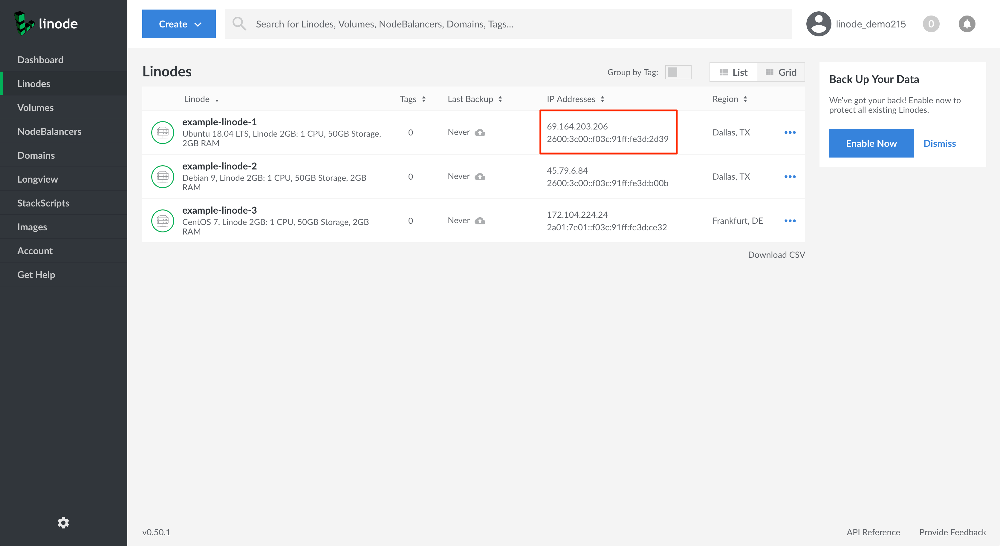
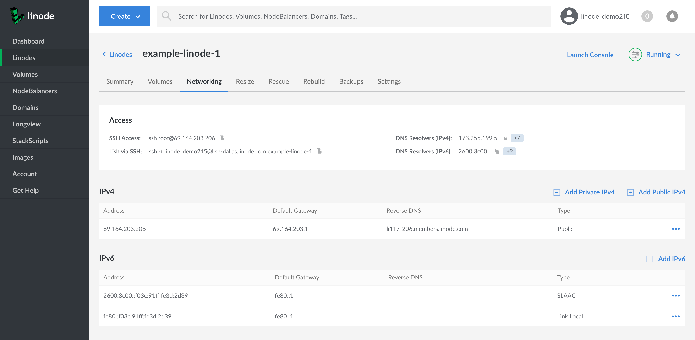

---
author:
  name: Linode
  email: docs@linode.com
description: 'This guide is a brief overview of IPv6 resources and support afforded by and available with Linode.'
og_description: "This guide is a brief overview of IPv6 support on Linode, including how to find your Linode's IPv6 address, how to request additional addresses, and information about address ranges and forwarding."
keywords: ["ipv6 networking", "IP configuration"]
aliases: ['networking/native-ipv6-networking/','networking/how-to-enable-native-ipv6-on-linux/']
license: '[CC BY-ND 4.0](https://creativecommons.org/licenses/by-nd/4.0)'
modified: 2019-03-12
modified_by:
  name: Linode
published: 2011-05-03
title: An Overview of IPv6 on Linode
external_resources:
 - '[Understanding IP Addressing](http://www.ripe.net/internet-coordination/press-centre/understanding-ip-addressing)'
 - '[IPv6 Chart](https://www.ripe.net/support/training/material/lir-training-course/LIR-Training-Handbook-Appendices/IPv6Chart_2015.pdf)'
---

## Default IPv6 Configuration

All Linodes are created with one IPv6 address, which is acquired by [*Stateless Address Autoconfiguration*](https://en.wikipedia.org/wiki/IPv6#Stateless_address_autoconfiguration_(SLAAC)) (SLAAC). IPv6 is fully enabled on all of Linode's supported operating systems and uses hardware-based addressing.

Linode does not offer private IPv6 address allocations. Our IPv6 accounting was designed so that local IPv6 traffic does not count against your [network transfer quota](/docs/platform/billing-and-support/network-transfer-quota/), so you can use your default IPv6 address as if it were a private IP address.


In order for your Linode to receive its SLAAC address, it must respond to IPv6's ping protocol.

Please be sure to allow ICMPv6 in your [firewall](/docs/security/securing-your-server#configure-a-firewall). For example, in `iptables`, you can issue the following commands:

    ip6tables -A INPUT -p icmpv6 -j ACCEPT
    ip6tables -A FORWARD -p icmpv6 -j ACCEPT


## How to Find Your IPv6 Address

You can find your Linode's IPv6 address using the Linode Cloud Manager or the `ip` tool with the Linux Terminal.
### Linode Cloud Manager

1. Log in to your [Linode Cloud Manager](https://cloud.linode.com/) account and select the Linodes link in the sidebar to view a list of all your Linodes.

1. On the Linodes page, under the *IP Addresses* column, you can quickly view each Linode's IP addresses.

    

1. To see a more detailed view, select the Linode whose IPv6 address you would like to find and click on its **Networking** tab.

1. Under the *IPv6* section, you can view the Linode's SLAAC and Link Local IPv6 addresses.

    

### Linux Terminal

1. Using your terminal, SSH into the Linode whose IPv6 address you would like to find.

        ssh user@192.0.2.0

1. Use the `ip` tool to find your Linode's IPv6 address:

        root@localhost:~# ip -6 address
        1: lo: <LOOPBACK,UP,LOWER_UP> mtu 65536 state UNKNOWN qlen 1
            inet6 ::1/128 scope host
              valid_lft forever preferred_lft forever
        3: eth0: <BROADCAST,MULTICAST,UP,LOWER_UP> mtu 1500 state UP qlen 1000
            inet6 2600:3c02::f03c:91ff:fe24:3a2f/64 scope global mngtmpaddr dynamic
              valid_lft 2591998sec preferred_lft 604798sec
            inet6 fe80::f03c:91ff:fe24:3a2f/64 scope link
              valid_lft forever preferred_lft forever

-  Line 3 shows the IPv6 loopback interface, `::1/128`. This is used for IPv6 traffic within the system, similar to the `127.0.0.0/8` IPv4 address block.

-  Line 6 is the Linode's public IP address, `600:3c02::f03c:91ff:fe24:3a2f/64`. You can see it's in a `/64` range.

-  Line 8 is the link-local IPv6 address, `fe80::f03c:91ff:fe24:3a2f/64`. An IPv6 link-local address is a unicast address that is automatically configured on any interface.

If your Linode does not have the correct IPv6 address or any IPv6 address at all, you should verify that you have router advertisements enabled and IPv6 privacy extensions disabled. Your Linode will need to accept router advertisements for SLAAC to function. These settings are properly configured by default in our supported distributions.

## Additional IPv6 Addresses

You can request additional IPv6 addresses at any time by opening a [support ticket](/docs/platform/billing-and-support/support/#contacting-linode-support). While default IPv6 addresses are configured automatically, you will need to statically configure each IPv6 address in the range you request. See our [static IP guide](/docs/networking/linux-static-ip-configuration) for instructions on how to do this.

## IPv6 Ranges and Pools


The IPv6 `/116` pool is not available in the Toronto data center.


IPv6 addresses are allocated in *ranges* and *pools*. The IPv6 range and pool sizes Linode provides and their respective quantity of IPv6 addresses are listed below.

<!--You will see where the range is routed under *Public IP Pools* on the Linode Manager's Remote Access tab.-->

| **Range**  | **Number of addresses**           |
|:------:|:-----------------------------:|
| /56    | 4,722,366,482,869,645,213,696 |
| /64    | 18,446,744,073,709,551,616    |

| **Pool**   | **Number of addresses**           |
|:------:|:-----------------------------:|
| /116   | 4,096                         |

## IPv6 Forwarding

For security reasons, IPv6 forwarding is not available on the Linode network. This is enforced by our network infrastructure.
