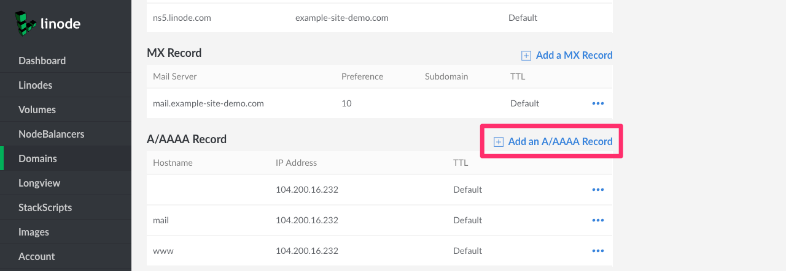
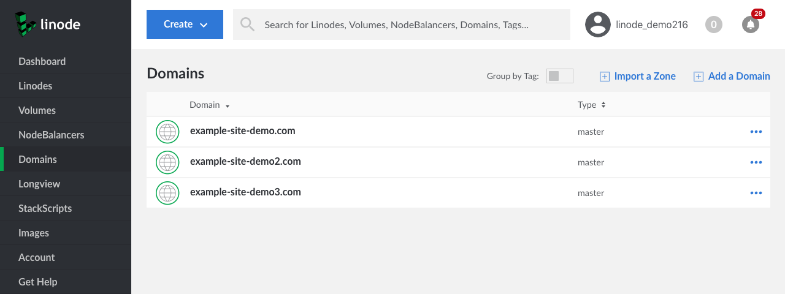
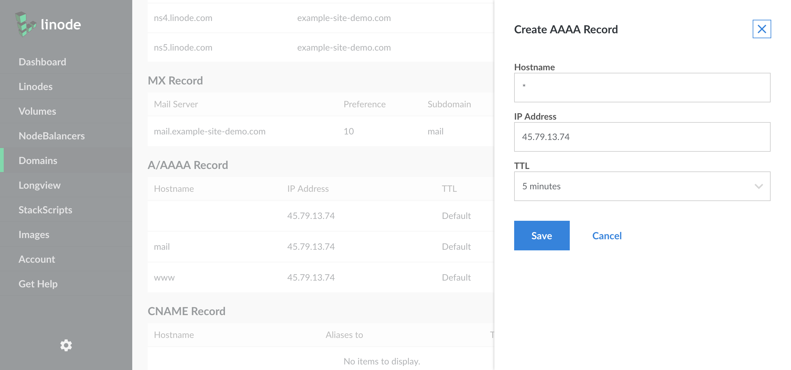

---
author:
  name: Linode
  email: docs@linode.com
description: 'Configurations for common DNS records.'
og_description: 'This guide explains how to use the Linode Cloud Manger to configure DNS records'
keywords: ["dns", "dnssec"]
license: '[CC BY-ND 4.0](https://creativecommons.org/licenses/by-nd/4.0)'
aliases: ['dns-manager/','dns-guides/configuring-dns-with-the-linode-manager/']
modified: 2019-03-14
modified_by:
  name: Linode
published: 2015-01-20
title: Common DNS Configurations
classic_manager_link: 'networking/dns/common-dns-configurations-classic-manager/'
---

## Set Up a Domain

The most common DNS configuration is a single domain name on a single Linode. For this, you'll need to add *SOA* and *NS records* for all of your name servers, and *A/AAAA* records for your domain names. Use the screenshot below as a guide.

[![The SOA record is set to "example-site-demo.com". The NS records are set to "ns1.linode.com" through "ns5.linode.com", inclusive. The MX record is set to "mail.example-site-demo.com". There are A records for [blank], which is the primary domain, and the "mail" and "www" subdomains. They are all set to the same IP.](common-dns-set-up-a-domain.png)](common-dns-set-up-a-domain.png)

 
The Domains section of the Cloud Manager can automatically add all of these records when you create a domain. For instructions, see the *Add a Domain* section of the [DNS Manager](/docs/networking/dns/dns-manager) guide.


## Configure Subdomains

1.  To configure a subdomain, such as `staging.example-site-demo.com`, create an A record with the subdomain's hostname. Click **Add an A/AAA Record**.

    

1.  Add the subdomain under the **Hostname** field. Point the record at the IP address of the server you want to host the subdomain:

    

1. Click on the **Save** button to create the record.

    
The Linode Cloud Manager does not support adding a subdomain of a subdomain in the same domain zone. For example, if you have `example.com` as a domain with an A record for `staging.example.com`, you cannot create `test.staging.example.com` within that same domain zone. Instead, create a new domain entry for the subdomain `staging.example.com`. Then, add an A record for `test.staging.example.com`.

See the [subdomains](/docs/platform/manager/dns-manager/#subdomains) section of the [DNS manager](/docs/platform/manager/dns-manager/#subdomains) guide for more information.
    

## Host Multiple Domains on a Single Server

To host multiple domain names on a single server, create a separate domain entry for each domain name as shown below. When creating the new domain entry, we recommend that you allow the Domains section of the Cloud Manager to automatically [insert basic records](/docs/networking/dns/dns-manager#add-a-domain-zone). At a minimum, you'll need an A record for each domain name pointing to the server's IP address.

## Use One Domain on Multiple Servers

If you have more than one server, but only one domain name, you can point A records with server-specific hostnames to all servers that need domain names. One machine will be the "front end" for the domain, by virtue of the first-level domain's A record pointing to it, but the domain can serve as a proxy for services provided by other machines, if needed. For example, if you wanted to create a development environment on another server, you could create an A record for `staging.example.com` and point it at another Linode's IP address.

## Route Email to Third-Party Mail Services

To route email to a third-party email service, create MX records that associate your mail server (for example, `mail.example-site-demo.com`) with a *hostname* provided by the third-party service. For instructions, see the website of your third-party email service.

## Use Wildcard DNS Records

A *wildcard* DNS record matches requests for non-existent domain names. For example, if you create an A record for `*.example.com`, and a user visits `nonexistantname.example.com`, that user will be redirected to `example.com`. An example wildcard DNS record is shown below.

