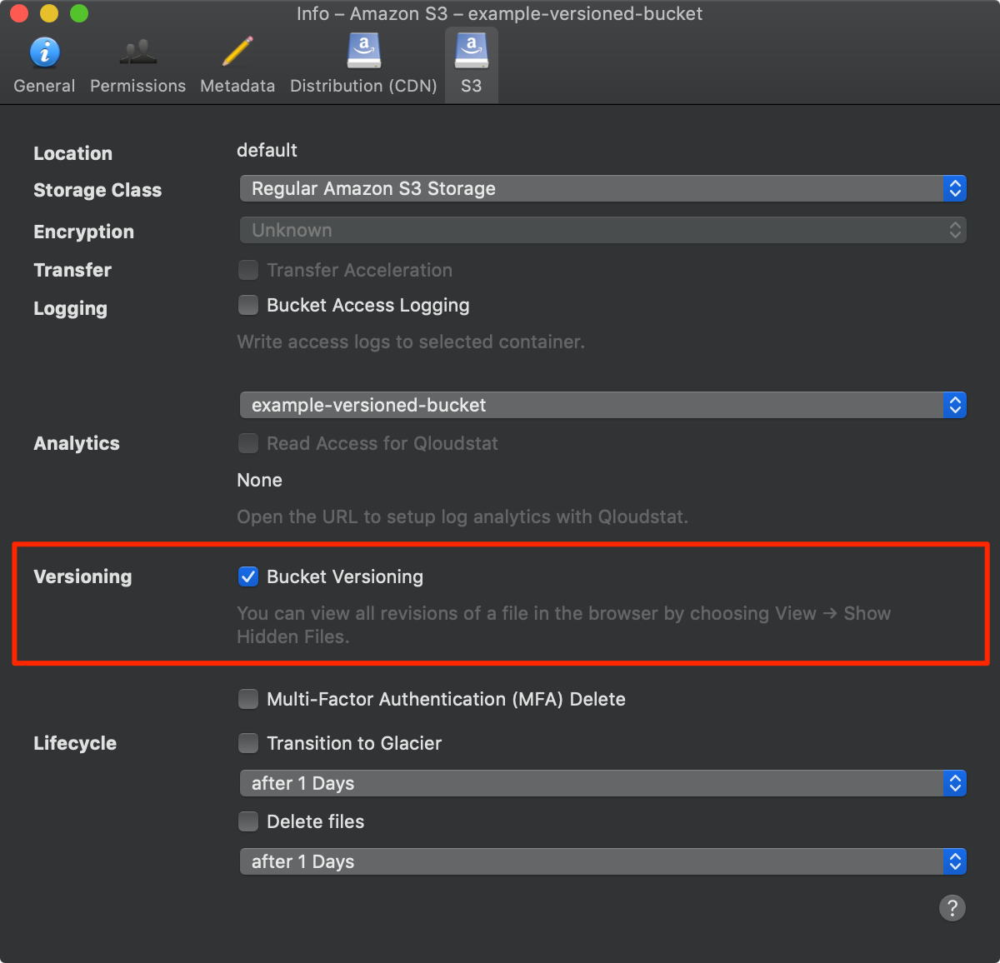

---
author:
  name: Linode Community
  email: docs@linode.com
description: 'How to use bucket versioning with Linode Object Storage to track and saves changes to your objects.'
keywords: ['object','storage','bucket','version','versioning']
license: '[CC BY-ND 4.0](https://creativecommons.org/licenses/by-nd/4.0)'
published: 2019-09-11
modified_by:
  name: Linode
title: "Bucket Versioning with Linode Object Storage"
contributor:
  name: Linode
---


Object Storage is currently in a closed early access Beta, and you may not have access to Object Storage through the Cloud Manager or other tools. To gain access to the Early Access Program (EAP), open up a Customer Support ticket noting that you’d like to be included in the program, or e-mail objbeta@linode.com – beta access is completely free.

Additionally, because Object Storage is in Beta, there may be breaking changes to how you access and manage Object Storage. This guide will be updated to reflect these changes if and when they occur.


Linode Object Storage allows for bucket versioning so that you can retain different versions of your objects within buckets. This makes it easy to save older versions of objects, as well as quickly revert to an object's previous state. This guide will show you how to version buckets using the AWS command line interface (CLI), as well as the graphical user interface (GUI) Cyberduck.

## Before You Begin

You should familiarize yourself with the basics of Linode Object Storage by reading the [How to Use Linode Object Storage guide](/docs/platform/object-storage/how-to-use-object-storage/). For this guide you'll need to have a bucket on which you want to enable bucket versioning.

## Bucket Versioning

Bucket versioning works by saving separate versions of objects in a bucket. When bucket versioning is enabled an object that is uploaded to a bucket won't overwrite a previous copy of that object. Instead, each version of the object is given a different ID number. When attempting to view the object over HTTP or to download the object, the latest object is returned. If you delete an object with bucket versioning enabled, a delete marker is inserted into the bucket to report that the object has been deleted, but the bucket will retain all previous versions of the object.


Every version of an object counts towards the monthly billable storage quota. While saving a few revisions is probably not worriesome, large version controlled buckets with many thousands of objects will see a noticeable increase in storage space demands, and should be monitored carefully.


### Cyberduck

Cyberduck is a graphical interface application that supports a wide variety of file transfer protocols, including S3-compatible Object Storage. For basic Cyberduck functionality, such as creating buckets and uploading objects, consult our [How to Use Linode Object Storage guide](/docs/platform/object-storage/how-to-use-object-storage/).

1.  To enable bucket versioning for a particular bucket, right click or control and click on the bucket and select **Info** from the bucket's context menu, or select **File > Info** from the menu bar.

    

2.  A settings menu will appear. Select the S3 menu heading.

    

3.  Next to *Versioning*, check the checkbox labeld **Bucket Versioning**.

    

4.  Your bucket will now retain previous versions of the objects within it. To test this functionality, create an example text document and add some text.

    
This is version 1 of the object.


    Upload this file to your bucket by dragging it into Cyberduck, or by selecting **File > Upload** from the menu bar.

1.  Now, edit the same file on your computer and make a small change. We will use this change to demonstrate bucket versioning.

    
This is version 2 of the object.


    Upload this file to your bucket just as you did in the previous step. Cyberduck will prompt you this time to confirm that you'd like to upload the file. Though the dropdown menu says "Overwrite," the file will not be overwritten.

    

1.  You now have two objects in your bucket, though initially you may only see one. To view the different saved versions of your object, select **View** from the menu bar and click on **Show Hidden Files**.

    You should now see two files in your bucket, with the hidden file that you've just revealed being grayed-out. This grayed-out file is the older version of the file that you uploaded first.

    
You may have to click the **Refresh** button to see the hidden files.


    

2.  Double click the grayed-out version of the file, the one with the earlier modified date, to download the file. Once opened, you'll see that the file contains the contents of the first revision.

3.  To revert to a previous file revision, right or hold Control and click on an object and select **Revert**. This will create a new object in the bucket, preserving the state of the previous two objects. At this point the current object will contain the contents of revision one, the second object will contain the contents of revision two, and the third object will contain to the contents of revision one. You can see, then, how bucket versioning works to maintain a stateful history, and not simply save random versions of objects.


Each file has it's own permissions. If you'd like to view objects via HTTP then you'll need to manually set the permissions for each object to *Everyone* each time you upload or revert to a different version of the object.


