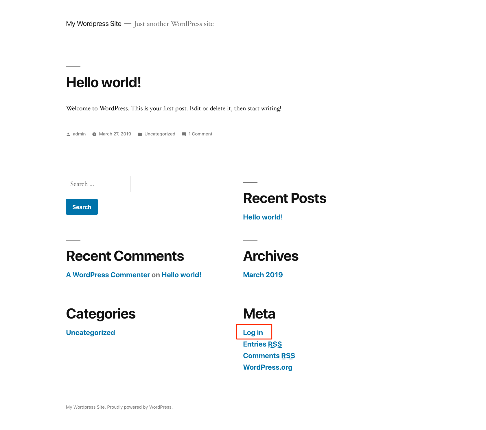

---
author:
  name: Linode Community
  email: docs@linode.com
description: 'Deploy a WordPress website on Linode using One-Click Apps.'
keywords: ['drupal','one-click', 'cms']
license: '[CC BY-ND 4.0](https://creativecommons.org/licenses/by-nd/4.0)'
published: 2019-03-27
modified: 2019-03-27
modified_by:
  name: Linode
title: "Deploy WordPress with One-Click Apps"
contributor:
  name: Linode
external_resources:
- '[WordPress Codex (Documentation)](https://codex.wordpress.org/)'
-
---

## WordPress One-Click App

With 60 million users around the globe, WordPress is the industry standard for content-focused websites such as blogs, news sites, and personal websites. With a focus on best in class usability and flexibility, you can have a customized website up and running in minutes.

### Deploy a WordPress One-Click App



The [WordPress Options](#wordpress-options) section of this guide provides details on all available configuration options for this app.

### WordPress Options

You can configure your WordPress App by providing values for the following fields:

| **Field** | **Description** |
|:--------------|:------------|
| **WordPress admin username** | Username for your WordPress admin user. *Required*. |
| **WordPress admin password** | Password for your WordPress admin user. *Required*. |
| **E-Mail for your WordPress account** | E-Mail address for your WordPress admin user. *Required*. |
| **Your SSH public key** | Your SSH public key. *Advanced Configuration* |
| **Site Title** | Your WordPress site's title. *Advanced Configuration* |

### Linode Options

After providing the app specific options, provide configurations for your Linode server:

| **Configuration** | **Description** |
|:--------------|:------------|
| **Select an Image** | Debian 9 is currently the only image supported by WordPress One-Click Apps. *Required* |
| **Region** | Choose the region where you would like your Linode to reside. If you’re not sure which to select, see our [How to Choose a Data Center](/docs/platform/how-to-choose-a-data-center) guide. You can also generate [MTR reports](/docs/networking/diagnostics/diagnosing-network-issues-with-mtr/) for a deeper look at the route path between you and a data center in each specific region. *Required* |
| **Linode Plan** | WordPress is an extremely flexible CMS that can be supported on any size Linode, but we suggest you build your WordPress app on a Linode plan that reflects how much content you plan on featuring as well as how much traffic you plan on having on your site. For small websites, a 1GB Nanode is sufficient. *Required* |
| **Linode Label** | Give your Linode a label. This is a name to help you easily identify it within the Cloud Manager’s Dashboard. |
| **Root Password** | Create a root password for your Linode in the Root Password field. This password must be provided when you log in to your Linode via SSH. It must be at least 6 characters long and contain characters from two of the following categories: lowercase and uppercase case letters, numbers, and punctuation characters. *Required* |

When you've provided all required Linode Options, click on the **Create** button. **Your WordPress app will complete installation anywhere between 2-5 minutes after your Linode has finished provisioning**.

### Getting Started After Deployment

After WordPress has finished installing, you will be able to access your WordPress site by copying your Linode's IPv4 address and entering it in the browser of your choice. To find your Linode's IPv4 address:

1. Click on the **Linodes** link in the sidebar. You will see a list of all your Linodes.

2. Find the Linode you just created when deploying your app and select it.

3. Navigate to the **Networking** tab.

4. Under the **IPv4** heading, you will find your IPv4 address listed under the **Address** column.

5. Copy and paste the IPv4 address into a browser window. You should see your WordPress site's home page.

    Once you have accessed your WordPress site via the browser, you can log in to your WordPress site using the admin credentials you created when deploying your One-Click WordPress App and begin configuring your site. The address of the WordPress login page is `http://< your IP address >/wp-login.php`, or you can click on the log in link, as highlighted below:

    

### Software Included

The WordPress One-Click App will install the following required software on your Linode:

| **Software** | **Description** |
|:--------------|:------------|
| **MySQL Server** | Database |
| **PHP 7** | WordPress is written in PHP and requires PHP to operate. |
| **Apache HTTP Server** | Web Server used to serve the WordPress site. |
| **WordPress** | Content management system. |