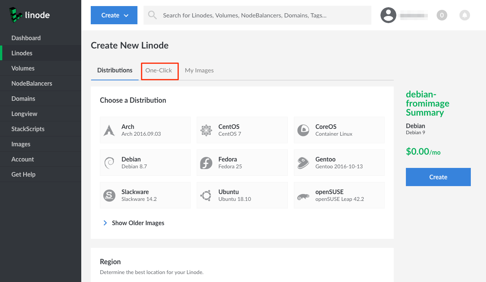
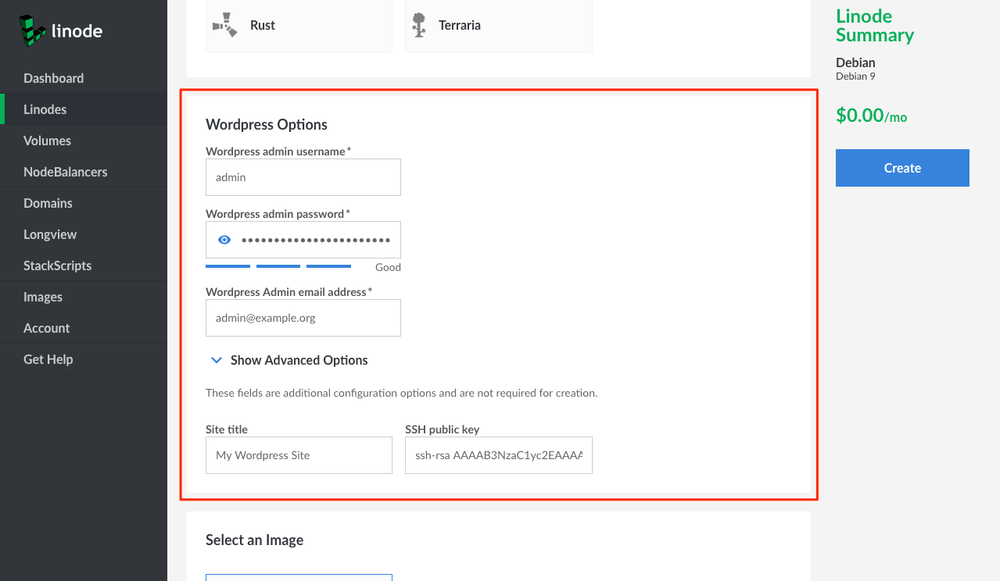
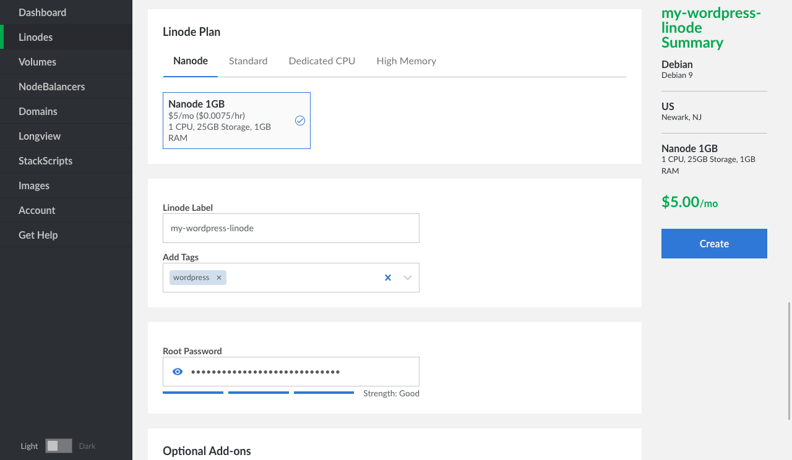

---
author:
  name: Linode Community
  email: docs@linode.com
description: 'How to deploy apps with one-click using the Linode Cloud Manager'
keywords: ['manager','cloud','app','one click']
license: '[CC BY-ND 4.0](https://creativecommons.org/licenses/by-nd/4.0)'
published: 2019-03-25
modified: 2019-03-25
modified_by:
  name: Linode
title: "How to Use One-Click Apps at Linode"
contributor:
  name: Linode
---

With One-Click Apps, you can deploy an ever expanding list of apps to the cloud through the Linode [Cloud Manager](https://cloud.linode.com), without the hassle of using the command line. One-Click App deployments create a Linode server and install the app of your choice on to it. Of course, you'll still have full access to your Linode if you want to log in to your server and have a more hands on approach. Below you will find instructions on where to find Cloud Apps, and how deploy your favorite game servers, WordPress, WooCommerce, and more.

## Creating an App

1.  Log in the the Linode [Cloud Manager](https://cloud.linode.com).
2.  Click **Create** at the top of the screen, and choose **Linode**:

    

3. The Linode creation screen appears. Under *Create New Linode*, select the **One-Click** tab:

    

4.  The One-Click menu appears in a box labeled *Create From*:

    

5.  Select the App you would like to create. For this example, WordPress will be selected:

    

6.  Under the *Select App* menu you'll find a new menu appears with additional configuration options. Fill out the required options, they will be marked with an asterisk. For WordPress you'll find fields for WordPress administrator username, password, and e-mail address.

    

    You can fill out additional options by clicking on *Show Advanced Options*. In the case of WordPress these options are the site title and a field for an SSH key, which you can use to log in to your server.

7.  Select Debian as your image. This is the underlying operating system that your App will run.

8.  Select your region. This is the data center where your Linode will be located. Choose a region that is close to your geopgraphic location.

9.  Select your Linode Plan. This is the size of the server you'd like to use, and this will be determined by the requirements of app. For small sites like WordPress blogs a 1GB Nanode is usually enough, for video game servers a 2GB or 4GB Linode should suffice. For this example, a 1GB Nanode is selected.

    

10. Create a label for you Linode. This will be how you reference your Linode in the Cloud Manager.
11. Create a root password.