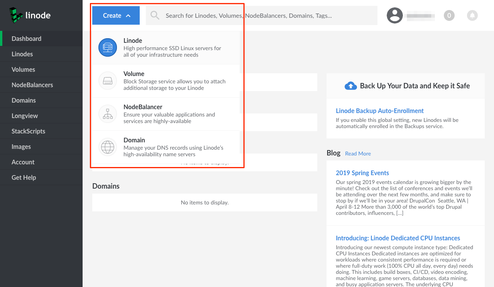
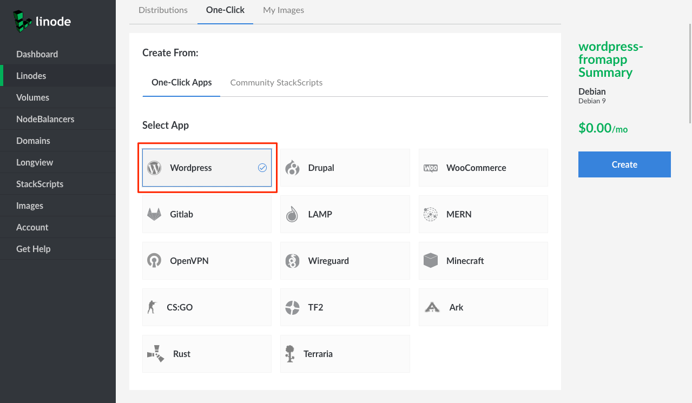
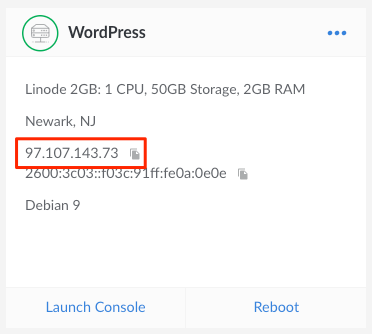

---
author:
  name: Linode Community
  email: docs@linode.com
description: 'How to deploy apps with one-click using the Linode Cloud Manager'
keywords: ['manager','cloud','app','one click']
license: '[CC BY-ND 4.0](https://creativecommons.org/licenses/by-nd/4.0)'
published: 2019-03-26
modified: 2019-03-26
modified_by:
  name: Linode
title: "How to Use One-Click Apps at Linode"
contributor:
  name: Linode
---

With One-Click Apps you can deploy an ever expanding list of apps to the cloud through the Linode [Cloud Manager](https://cloud.linode.com), without the hassle of using the command line. One-Click Apps install the software of your choice for you on a Linode server at the time of its creation. Of course, you'll still have full access to your Linode if you want to log in to your server and have a more hands on approach later on. Below you will find instructions on where to find One-Click Apps, and how deploy your favorite game servers, WordPress blogs, WooCommerce stores, and more.

## Creating an App

1.  Log in the the Linode [Cloud Manager](https://cloud.linode.com).

2.  Click **Create** at the top of the screen, and choose **Linode**:

    

3. The Linode creation screen appears. Under *Create New Linode*, select the **One-Click** tab:

    

4.  The One-Click menu appears in a box labeled *Create From*. Ensure that the **One-Click Apps** tab is selected:

    

5.  Select the app you would like to create. For this example, WordPress will be selected:

    

6.  Under the *Select App* menu you'll find a new menu with additional configuration options specific to your app. Fill out the required options, they will be marked with an asterisk. In the case of WordPress, you'll find fields for WordPress administrator username, password, and e-mail address.

    

    You can fill out additional options by clicking on **Show Advanced Options**. In the case of WordPress, these options are the site title field and a field for an SSH key, which you can use to log in to your server.

7.  Select Debian as your Linux image. This is the underlying operating system that your app will run.

8.  Select your region. This is the data center where your Linode will be located. Choose a region that is close to your audience's geographic location.

9.  Select your Linode plan. This is the size of the server you'd like to use. This will be determined by the requirements of your app. For small sites like WordPress blogs a 1GB Nanode is usually enough, for video game servers a 2GB or 4GB Linode is normally enough. You can always upgrade your Linode later if you need more memory or CPU cores.

    
You can upgrade and downgrade servers at any time as you see fit. The only thing you need to remember when downgrading is that the files on your Linode disk must fit into the disk of the smaller Linode plan. For more information, see our [Resizing a Linode guide](https://www.linode.com/docs/platform/disk-images/resizing-a-linode/).


     For this example, a 1GB Nanode is selected.

    

1.  Create a label and tags for you Linode. These will be used to reference and organize your Linode within the Cloud Manager.

2.  Create a root password. This is **not** the password for your WordPress site or game, or whatever other app you have chosen. Instead, this is the password for the server itself. You will need it if you ever decide to perform maintenance on your server in the future. Please create a strong password and store it somewhere secure for future reference. If you forget your root password, check out our [Reset the Root Password on Your Linode guide](https://www.linode.com/docs/quick-answers/linode-platform/reset-the-root-password-on-your-linode/).

    
If someone were trying to exploit your server, the root password is the one of the first things they'll try to attack. A strong password is the first step in securing your server. For more information on securing your server, check out our [Secure Your Server guide](https://linode.com/docs/security/securing-your-server/).


3.  Once you have completed all of the above steps, click **Create**.

You will be taken to the Linode Dashboard where you can monitor the status of your Linode's creation. Once your Linode has been created, the Cloud Manager will start to deploy your app in the background. **This will take several minutes**. Once your app has been deployed it will be available at the IP address of the Linode you created.

## Accessing Your App

Depending on the type of app you created, the app will be accessible in different ways. But, all the ways to access your app require the IP address of your Linode. Follow the instructions below to find your IP address.

1.  Log in to the [Cloud Manager](https://cloud.linode.com).

2.  Navigate to the Linodes page by clicking on the **Linodes** link in the sidebar.

3.  Find the Linode that you created. The IP address is a series of four numbers separated by periods. In the grid view, your IP address will look like the following:

    

    In list view, your IP address will look liks the following:

    

Copy your IP address. For apps like WordPress, WooCommerce, and Drupal, you can navigate to the IP address in your browser to visit your installation. For game servers, connect to the IP address in-game to play on your new server.

## Adding a Domain Name for Your App

For websites like WordPress, WooCommerce, and Drupal, it's much more desireable to have a domain name rather than using an IP address to access your app. For information on how to add a domain name to your app, visit our [DNS Manager guide](https://linode.com/docs/platform/manager/dns-manager/#add-dns-records).

## Connecting to You Server Remotely

Because every app is deployed to an underlying Linode, you can access your server at the Linux level with Secure Shell (SSH) using `root` as your username and the root password you defined when creating your Linode. Follow our [Getting Started guide](https://www.linode.com/docs/getting-started/#connect-to-your-linode-via-ssh) to learn more about connecting to your Linode via SSH.